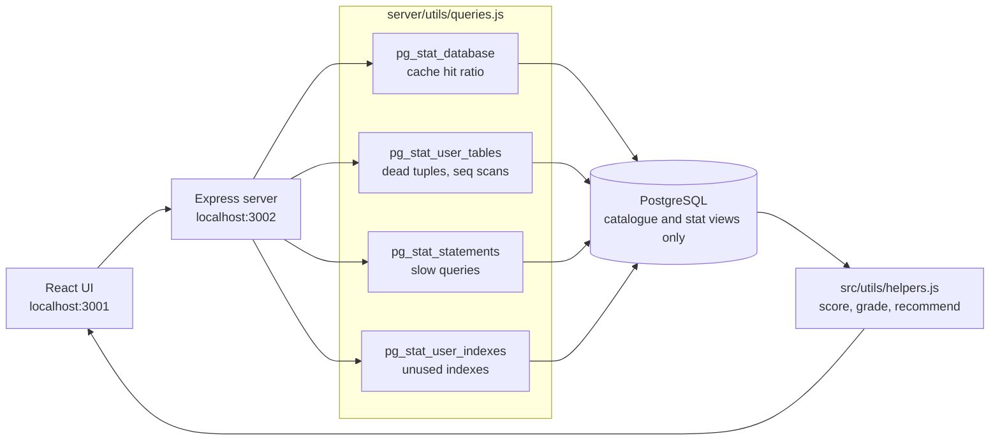

# postgres-analyzer


Connects to a PostgreSQL instance, reads what the server already knows about
itself, and turns it into a health picture: cache hit ratio, slow queries, dead
tuples, unused indexes, blocking locks, partition layout, connection pressure.

Every query it runs targets `pg_catalog` and the `pg_stat_*` views. It never
reads your application tables, and it never writes anything. Point it at a
read-only role and it still works fully.

## Why

`pg_stat_statements` and friends already contain the answer to "why is this
database slow". The problem is that reading them means remembering a dozen
catalogue queries and doing the ratio maths by hand, per database, every time.
This runs the catalogue queries, does the arithmetic, and ranks the findings so
the worst thing is at the top.

## It is checked against a real server

Unit tests cannot tell you a query returns the right answer -- valid SQL can
pass every test and still be wrong. So the queries run against a live
PostgreSQL with a deliberately awkward fixture: a table named `"Weird.Name"`,
an index nothing uses, a table with no primary key, and real sessions made to
block each other.

```bash
docker compose -f docker-compose.test.yml up -d
node server/scripts/verify-queries.js
```

```
--- blocking detection, with real locks ------------------------------
  179 blocks 180  (ROOT CAUSE, waited 1.5s)
  180 blocks 181  (also blocked, waited 1.5s)
  PASS  blocking is detected at all
  PASS  exactly one session is identified as the root cause
  PASS  and it is the session actually holding the lock

10 queries executed, 0 checks failed
```

[Full transcript below](#verifying-it-against-a-real-database).

## How it works



Read-only by construction: every statement targets `pg_catalog` or a
`pg_stat_*` view, so a read-only role loses no functionality.

## Running it

Two processes: an Express API that talks to Postgres, and a React UI.

```bash
npm install
cd server && npm install && cd ..

cp .env.example server/.env   # then edit it

cd server && npm start        # API on :3002
npm start                     # UI on :3001
```

Connections come from `.env`. The UI selects between the ones loaded at
startup; it does not register new ones at runtime. There is a
`DatabaseConnection` component that accepts host and credentials, but this build
does not mount it, and the analysis endpoint keys off `connectionId` and ignores
those fields — so an earlier version of this README describing runtime
connection entry was describing something that does not happen.

Passwords are never returned by the API either way.

## What it reports

| Area | Signal |
|---|---|
| Cache | Buffer cache hit ratio, and whether it is below the healthy band |
| Queries | Slowest statements by **total** execution time, via `pg_stat_statements` |
| Tables | Dead tuple ratio, sequential scans on large tables, bloat indicators |
| Indexes | Never-used and rarely-used indexes, with the cost of keeping them |
| Locks | Currently blocked queries and what is blocking them |
| Connections | Active, idle, and idle-in-transaction counts against `max_connections` |
| Partitions | Inheritance and partition layout per parent table |

Findings are grouped into immediate, this-week and this-month actions, because
"you have 40 problems" is not a plan.

`pg_stat_statements` is optional. The tool detects whether the extension is
installed and degrades to what it can see without it, rather than failing.

## On the "claude" naming

`server/routes/claude.js` and `src/components/claude/` predate any LLM
integration and the name stuck. **There is no Anthropic dependency and no API
call to any model.** The analysis is rule-based, in plain JavaScript, and you
can read every threshold.

What the `/analyze-for-claude` endpoint does is assemble the full diagnostic
payload as JSON so you can hand it to an LLM yourself if you want a second
opinion. The tool reaches its own conclusions without one.

## Security notes

- `.env` is gitignored. Keep it that way; the file holds database passwords.
- **Use a role with `pg_monitor`.** Plain `SELECT` on the catalogues is not
  enough, and the failure is silent rather than loud.

  Measured on PostgreSQL 16, with another session running `SELECT pg_sleep(20)`:

  | Role | Rows visible in `pg_stat_activity` |
  |---|---|
  | ordinary role with `SELECT` | **1** — its own session only |
  | same role after `GRANT pg_monitor` | **3** — every session, with query text |

  An ordinary role does not see other sessions at all. Nothing errors: the
  blocking panel simply comes back empty, which reads as "nothing is blocking"
  on a database that may be badly stuck. That is the wrong way round for a
  diagnostic tool, so grant `pg_monitor` (or `pg_read_all_stats`).

  Nothing here needs write access, and nothing here reads your table data —
  only the catalogues and the statistics views.
- The API never returns a password. `/api/database/connection-config` reports
  `hasPassword: true|false` so the UI can show whether one is configured.
- **The API has no authentication by default.** It is built to run on
  `localhost` alongside the UI. Anything it can read from your database —
  including `pg_stat_statements` query text, connected users and client
  addresses — is readable by anything that can reach the port.

  Three defaults exist to keep that contained, and they are defaults rather
  than guarantees:

  | Setting | Default | Why |
  |---|---|---|
  | `HOST` | `127.0.0.1` | Binding `0.0.0.0` put an unauthenticated tool that holds database credentials on every interface, reachable from the whole local network |
  | `ALLOWED_ORIGINS` | `http://localhost:3001` | Open CORS meant any page in your browser could drive this server and read the results |
  | `API_TOKEN` | unset | Set it and every `/api` route requires `x-api-token`. Required if you change `HOST`; the server warns at startup if you did not |

  Error responses no longer include the server's own connection settings.
  `DEBUG_CONNECTION_DETAILS=true` puts them back when you are debugging a
  connection failure and can see who is asking.
- `rejectUnauthorized: false` is set on SSL connections, which accepts
  self-signed certificates. Convenient against a managed instance behind a
  bastion, wrong for anything reachable from the open internet. Change it if
  your threat model is not "inside the VPC".

## Verifying it against a real database

Unit tests check the code around the queries. They cannot tell you whether a
query returns the right answer, because a query can be valid SQL, pass every
test, and still be wrong.

So there is a second check that runs the real queries against a real server:

```bash
docker compose -f docker-compose.test.yml up -d
node server/scripts/verify-queries.js
```

It builds a deliberately awkward fixture — a table named `"Weird.Name"`, an
index nothing uses, a table with no primary key — then opens real sessions and
makes them block each other. Output from an actual run:

```
PostgreSQL 16.15 at 127.0.0.1:55432

--- every query, against a live server -------------------------------
  PASS  databaseInfo             1 rows
  PASS  cacheHitRatio            1 rows
  PASS  tableStats               3 rows
  PASS  slowQueries              0 rows
  PASS  partitioningInfo         0 rows
  PASS  blockingQueries          0 rows
  PASS  indexUsage               3 rows
  PASS  connectionStats          1 rows
  PASS  lockStats                2 rows
  PASS  userStats                2 rows

--- do the numbers match the fixture? --------------------------------
  PASS  orders reports 20000 live tuples
  PASS  a table with a dot in its name is listed
  PASS  "Weird.Name" is correctly reported as having no primary key
  PASS  orders is correctly reported as having a primary key
  PASS  the deliberately unused index shows 0 scans
  PASS  one idle client connection is counted
  PASS  total equals the states beneath it

--- blocking detection, with real locks ------------------------------
  187 blocks 185  (ROOT CAUSE, waited 1.5s)
  185 blocks 186  (also blocked, waited 1.5s)
  PASS  blocking is detected at all
  PASS  exactly one session is identified as the root cause
  PASS  and it is the session actually holding the lock

10 queries executed, 0 checks failed
```

Session ids and some row counts differ per run -- `slowQueries` in particular
depends on what `pg_stat_statements` has observed. The PASS lines are the
assertions; the counts beside them are incidental.

Every figure above comes from a throwaway container full of generated rows.
None of it is production data, and the numbers describe the fixture rather than
any real system.

Running this is how three defects were found, all of them after the unit suite
was green:

- **`tableStats` crashed on any database containing a table with a dot in its
  name.** It built `schemaname||'.'||relname` unquoted, so PostgreSQL read
  `"Weird.Name"` as a cross-database reference and rejected the query. One
  awkwardly named table broke the panel for every table. It now uses `relid`.
- **`connectionStats` counted PostgreSQL's own background workers.** Checkpointer,
  walwriter and the autovacuum launcher appear in `pg_stat_activity` with a NULL
  state, so an idle server reported five connections of which none were active
  and none idle — a total that matched nothing beneath it. "Stale" and "hung"
  were also keyed off `backend_start`, the age of the connection, rather than
  how long it had been idle or how long its transaction had been open.
- **`blockingQueries` named a stuck session as the one to kill.** Waiters queue,
  each holding a transient tuple lock, so the second waiter appeared to be
  blocked by the first. It now uses `pg_blocking_pids()` and flags whether each
  blocker is itself blocked, so a root cause is distinguishable from a link in
  the chain.

## Built with

React, Express, `node-postgres`.

## What it does not do

- **Slow-query analysis needs `pg_stat_statements`.** Without that extension
  loaded, that panel is empty. Nothing else depends on it.
- **Statistics are cumulative since the last reset.** "Unused index" means
  unused since the counters were last cleared, so an index serving a monthly
  job looks dead for twenty-nine days. Check `stats_reset` before dropping
  anything.
- **A snapshot, not a time series.** It reads current catalogue state. For
  trends over time, feed a metrics pipeline instead.
- **No query plans.** It reports which statements are expensive, not why. The
  `EXPLAIN` step is still yours.
- **Single instance.** No replica awareness, no connection pooler visibility,
  no cross-shard view.
- **The recommendations are starting points.** An index suggestion names a
  placeholder column, because the tool sees statistics rather than your query
  shapes.

## Contributing

Bug reports and pull requests are welcome. [CONTRIBUTING.md](CONTRIBUTING.md)
covers the setup and the gate that must be green before a PR. Everyone taking
part is expected to follow the [Code of Conduct](CODE_OF_CONDUCT.md).

For a security problem, do not open an issue: see [SECURITY.md](SECURITY.md).

## License

MIT. See [LICENSE](LICENSE).
